How to set up an ssh server behind i2p for personal access
==========================================================

[This guide is also available in i2p: 566niximlxdzpanmn4qouucvua3k7neniwss47li5r6ugoertzuq.b32.i2p](http://566niximlxdzpanmn4qouucvua3k7neniwss47li5r6ugoertzuq.b32.i2p)

This is a tutorial on how to set up and tweak an i2p tunnel in order to use it
to access an SSH server remotely, using either i2p or i2pd. For now, it assumes
you will install your SSH server from a package manager and that it's running
as a service.

Considerations: In this guide, I'm assuming a few things. They will need to be
adjusted depending on the complications that arise in your particular setup,
especially if you use VM's or containers for isolation. This assumes that the
i2p router and the ssh server are running on the same localhost.

Step One: Set up i2p tunnel for SSH Server
------------------------------------------

### Using Java i2p

Using java i2p's web interface, navigate to the (Links to your Router Console)[Hidden Services Manager](http://127.0.0.1:7657/i2ptunnelmgr)
and start the tunnel wizard.

#### Tunnel Wizard

Since you are setting up this tunnel for the SSH server, you need to select the
"Server" tunnel type.

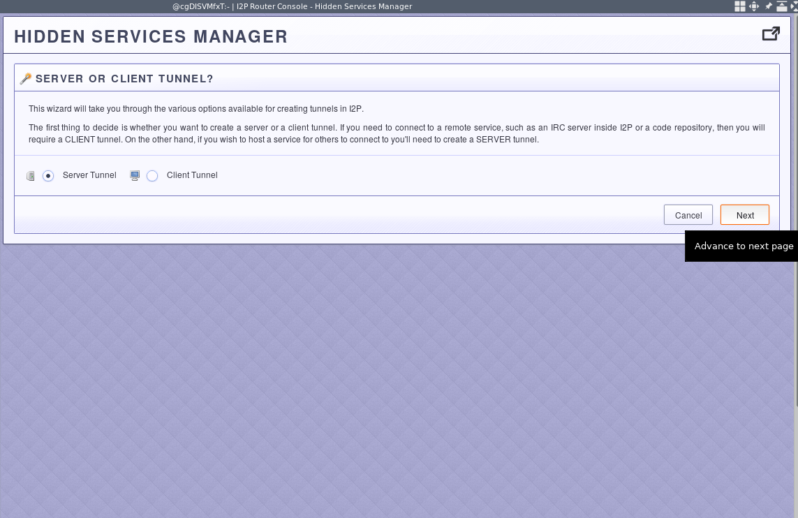

You should fine-tune it later, but the Standard tunnel type is easiest to start
with.

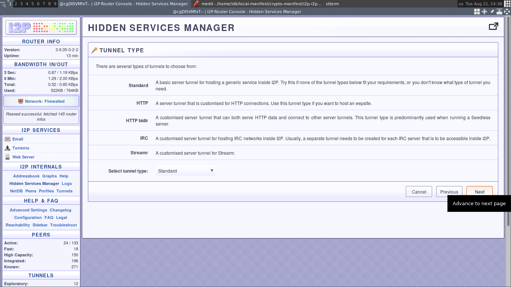

Give it a good description:

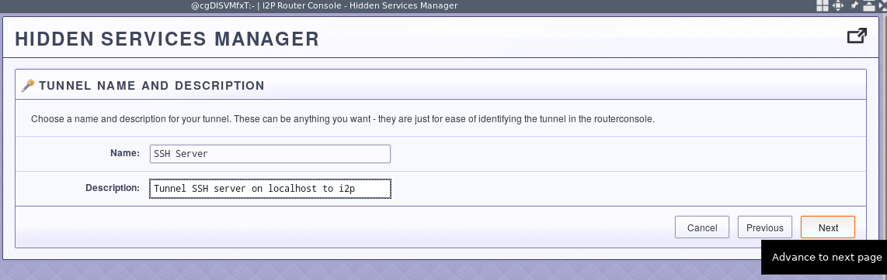

And tell it where the SSH server will be available.

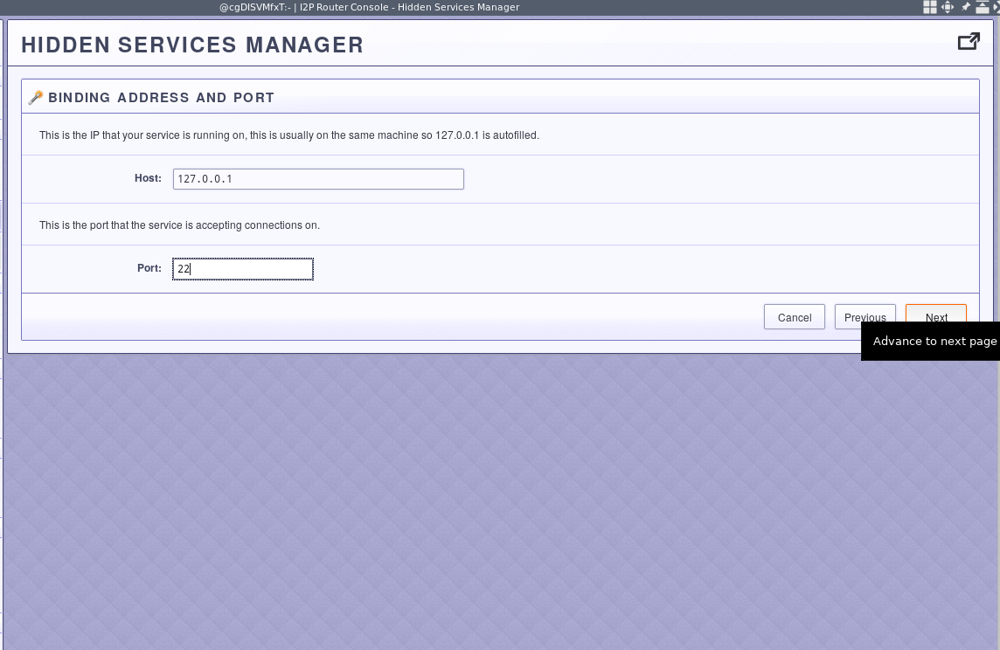

Look over the results, and save your settings.

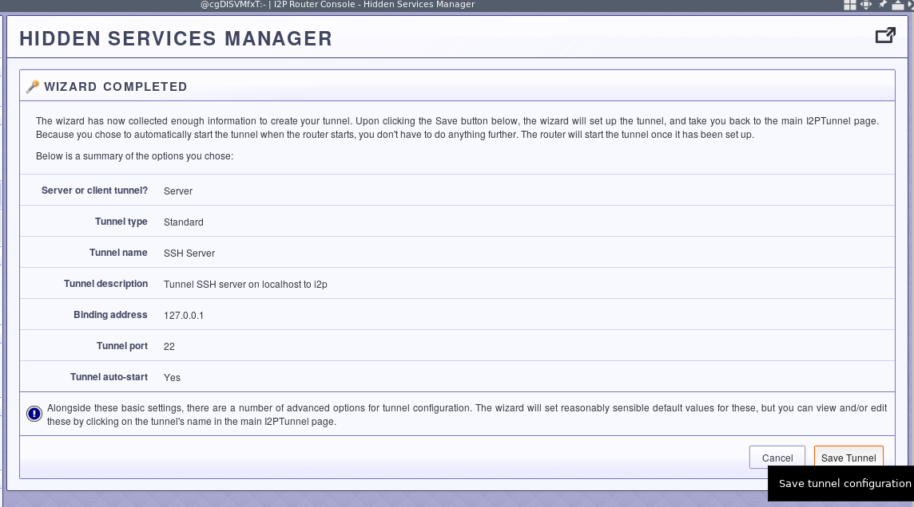

#### Advanced Settings

Now head back over the the Hidden Services Manager, and look over the available
advanced settings. One thing you'll definitely want to change is to set it up
for interactive connections intstead of bulk connections.

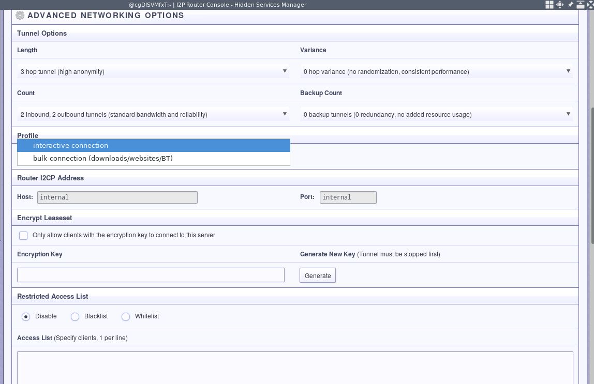

Besides that, these other options can affect performance when accessing your SSH
server. If you aren't that concerned about your anonymity, then you could reduce
the number of hops you take. If you have trouble with speed, a higher tunnel
count might help. A few backup tunnels are probably a good idea. You might have
to dial-it-in a bit.

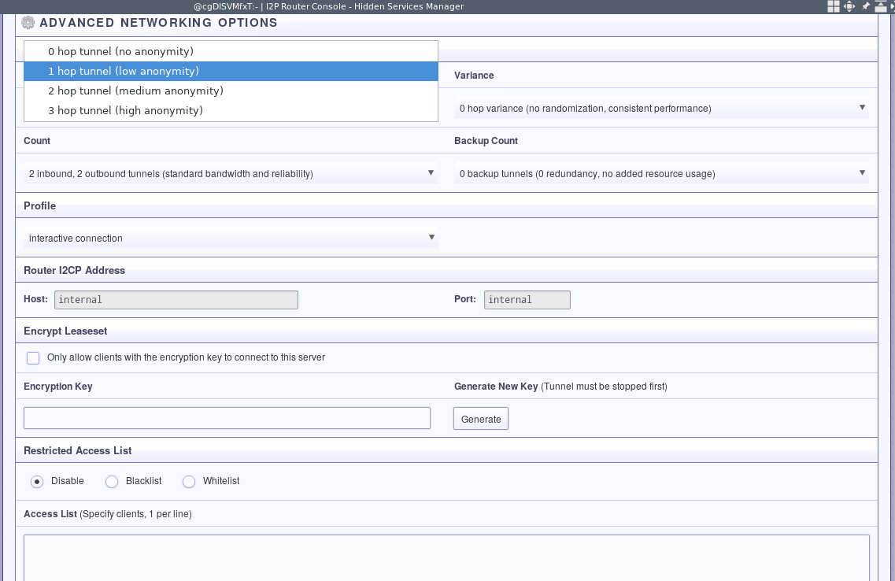

Finally, restart the tunnel so that all of your settings take effect.

Another interesting setting, especially if you choose to run a high number of
tunnels is "Reduce on Idle" which will reduce the number of tunnels that run
when the serve has experienced extended inactivity.

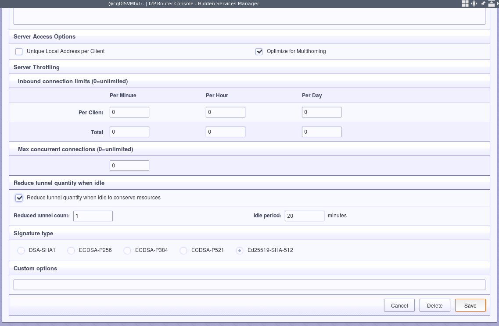

### Using i2pd

With i2pd, all configuration is done with files instead of via a web interface.
In order to configure an SSH Service tunnel for i2pd, tweak the following
example settings to your anonymity and performance needs and copy them into
tunnels.conf

        [SSH-SERVER]
        type = server
        port = 22
        inbound.length = 1
        outbound.length = 1
        inbound.quantity = 5
        outbound.quantity = 5
        inbound.backupQuantity = 2
        outbound.backupQuantity = 2
        i2cp.reduceOnIdle = true
        keys = ssh-in.dat

### Restart your i2p router

Step Two: Set up SSH server
---------------------------

Depending on how you want to access your SSH Server, you may want to make a few
changes to the settings. Besides the obvious SSH hardening stuff you should do
on all SSH servers(Public-Key Authentication, no login as root, etc), if you
don't want your SSH server to listen on any addresses except your server tunnel,
you should change AddressFamily to inet and ListenAddress to 127.0.0.1.

        AddressFamily inet
        ListenAddress 127.0.0.1

If you choose to use a port other than 22 for your SSH server, you will need to
change the port in your i2p tunnel configuration.

Step Three: Set up i2p tunnel for SSH Client
--------------------------------------------

You will need to be able to see the i2p router console of the SSH server in
order to configure your client connection. One neat thing about this setup is
that the initial connection to the i2p tunnel is authenticated, somewhat
reducing the risk of your initial connection to the SSH server being MITM'ed,
as is a risk in Trust-On-First-Use scenarios.

### Using Java i2p

#### Tunnel Wizard

First, start the tunnel configuration wizard from the hidden services manager
and select a client tunnel.

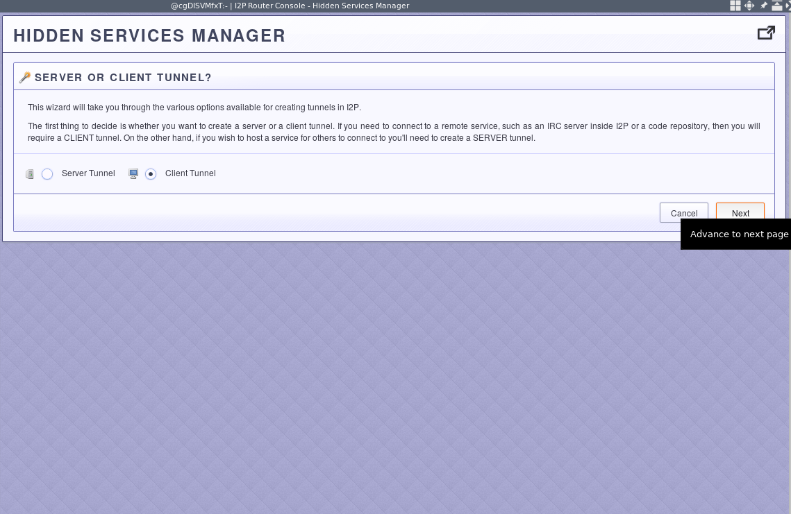

Next, select the standard tunnel type. You will fine-tune this configuration
later.

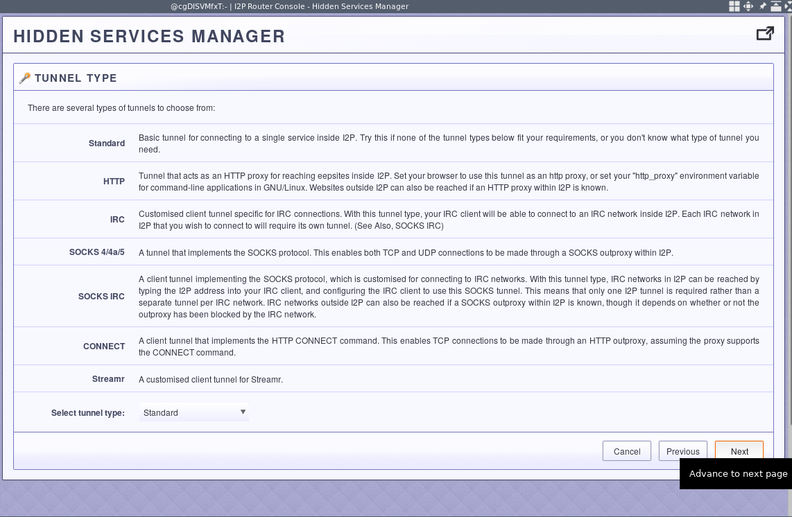

Give it a good description.

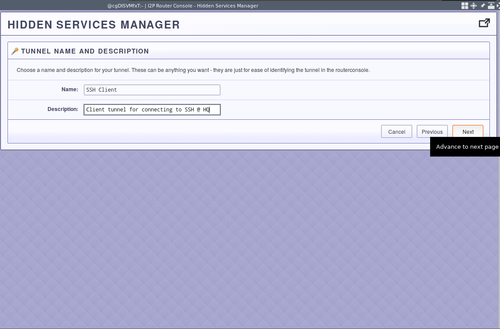

This is the only slightly tricky part. Go to the hidden services manager of the
i2p router console and find the base64 "local destination" of the SSH server
tunnel. You'll need to find a way to copy this information into the next step.
I generally [Tox](https://tox.chat) it to myself, any off-the-record
should be sufficient for most people.

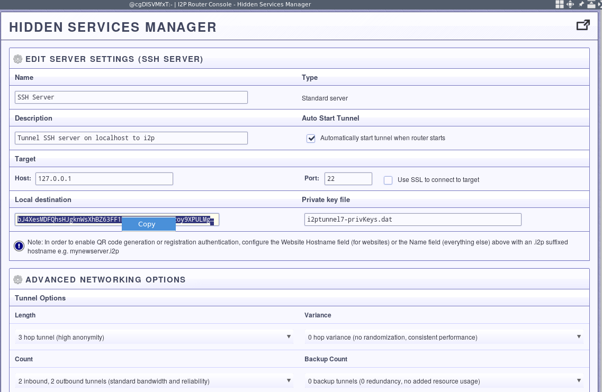

Once you've found the base64 destination you want to connect to transmitted to
your client device, then paste it into the client destination field.

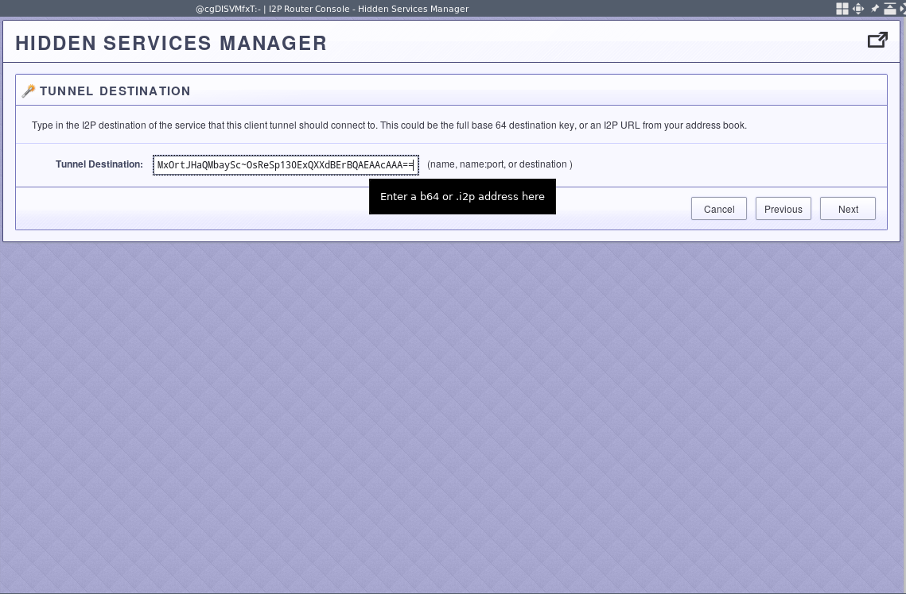

Lastly, set a local port to connect your ssh client to. This will local port
will be connected to the base64 destination and thus the SSH server.

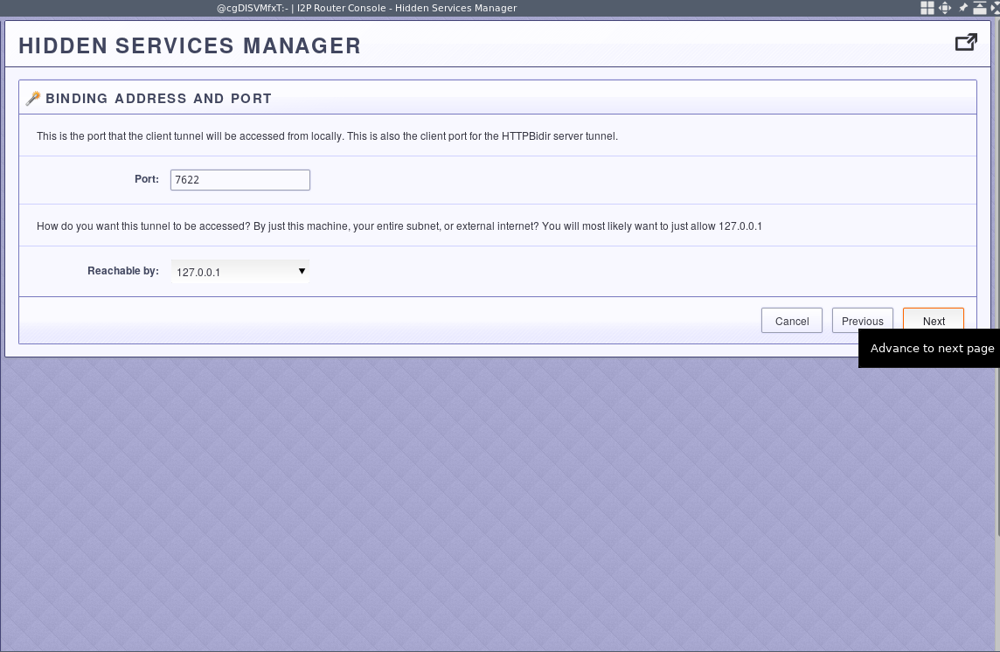

Decide whether you want it to start automatically.

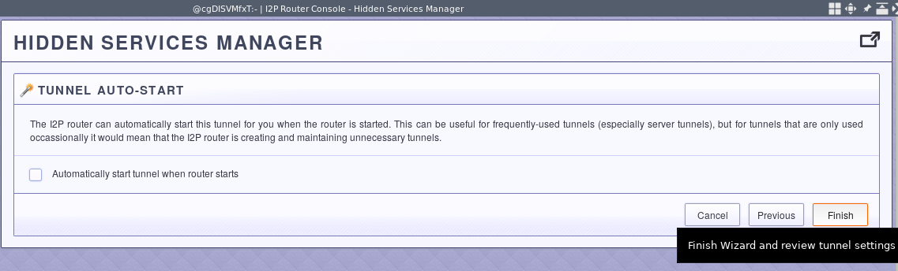

#### Advanced Settings

Like before, you'll want to change the settings to be optimized for interactive
connections. Additionally, if you want to set up client whiteliting on the
server, you should check the "Generate key to enable persistent client tunnel
identity" radial button.

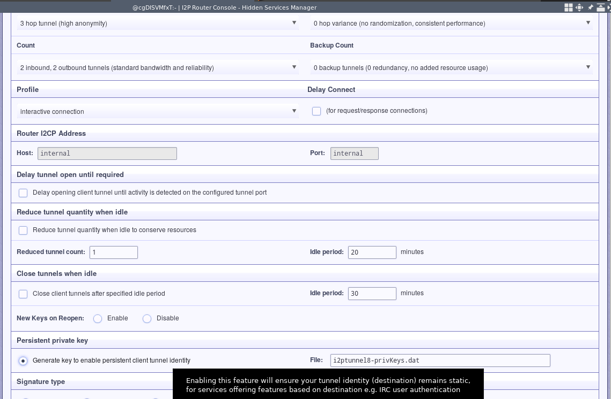

### Using i2pd

You can set this up by adding the following lines to your tunnels.conf and
adjust it for your performance/anonymity needs.

        [SSH-CLIENT]
        type = client
        host = 127.0.0.1
        port = 7622
        inbound.length = 1
        outbound.length = 1
        inbound.quantity = 5
        outbound.quantity = 5
        inbound.backupQuantity = 2
        outbound.backupQuantity = 2
        i2cp.dontPublishLeaseSet = true
        destination = bubfjkl2l46pevgnh7yicm2e7rkld4jrgpmruw2ueqn5fa4ag6eq.b32.i2p
        keys = ssh-in.dat

### Restart the i2p router on the client

Step Four: Set up SSH client
----------------------------

There are lots of ways to set up an SSH client to connect to your server on i2p,
but there are a few things you should do to secure your SSH client for anonymous
use. First, you should configure it to only identify itself to SSH server with
a single, specific key so that you don't risk contaminating your anonymous and
non-anonymous SSH connections.

Make sure your $HOME/.ssh/config contains the following lines:

        IdentitiesOnly yes

        Host 127.0.0.1
          IdentityFile ~/.ssh/login_id_ed25519

Alternatively, you could make a .bash\_alias entry to enforce your options and
automatically connect to i2p. You get the idea, you need to enforce
IdentitiesOnly and provide an identity file.

        i2pssh() {
            ssh -o IdentitiesOnly=yes -o IdentityFile=~/.ssh/login_id_ed25519 serveruser@127.0.0.1:7622
        }

#### Step Five: Whitelist only the client tunnel

This is more-or-less optional, but it's pretty cool and will prevent anyone who
happens to come across your destination from being able to tell you are hosting
an SSH service.

First, retrieve the persistent client tunnel destination and transmit it to the
server.

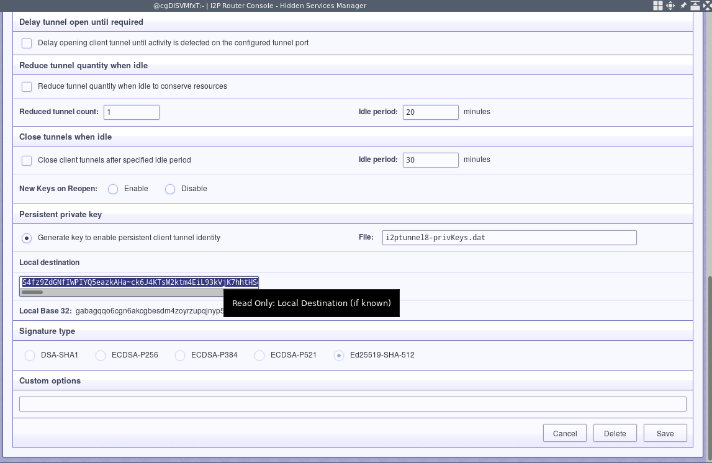

Add the client's base64 destination to the server's destination whitelist. Now
you'll only be able to connect to the server tunnel from that specific client
tunnel and no one else will be able to connect to that destination.

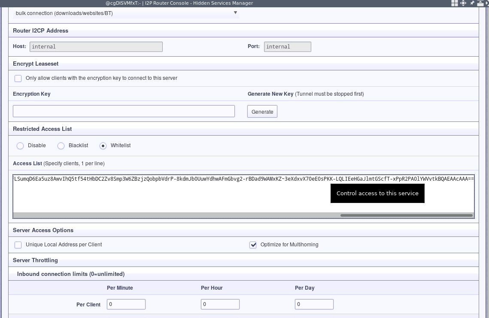

Mutual authentication FTW.
